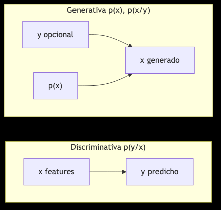
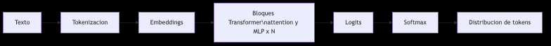
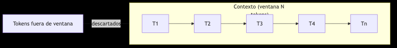
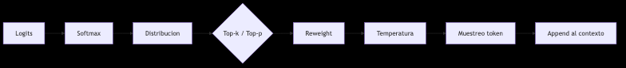

<!-- _class: lead -->

# 

---

## Analítica discriminativa vs generativa

- Discriminativa: modela p(y|x) para predecir etiquetas dada una entrada.
  - Ejemplos: Regresión logística, SVM, Random Forest, XGBoost, clasificadores.
  - Uso típico: clasificación, scoring, detección de fraude.
- Generativa: modela p(x) o p(x|y) para generar datos plausibles.
  - Ejemplos: LLMs, VAEs, Diffusion, GANs; sintetizan texto, imágenes, audio.
- Idea clave: lo generativo crea nuevas muestras coherentes; lo discriminativo decide entre clases.

---

## Gráfico: Discriminativa vs Generativa

---

## ¿Qué es un LLM?

- Modelo generativo entrenado para predecir el siguiente token en secuencias de texto.
- Arquitectura Transformer con auto‑atención (self‑attention).
- Escala: miles de millones de parámetros y grandes corpus.
- Capacidades emergentes: razonamiento, traducción, escritura guiada.

---

## Diagrama: Pipeline simplificado de un LLM

---

## Tokens, contexto y ventanas

- Token: sub‑unidad de texto (≈ palabras/fracciones).
- Ventana de contexto: longitud máxima de tokens en prompt + respuesta.
- Implicaciones: coste, latencia y truncado de entradas extensas.
- Práctica: resumir/segmentar, RAG, estructurar contexto esencial primero.

---

## Visual: Ventana de contexto

---

## Objetivo de entrenamiento

- Next‑token prediction: dado el prefijo, maximiza la probabilidad del siguiente token.
- Consecuencia: el modelo aprende patrones estadísticos y semánticos del lenguaje.
- Ajustes: instrucción (SFT) y RLHF para alinear con expectativas humanas.

---

## Ajuste fino y alineación

- Fine‑tuning (SFT): ejemplos de instrucciones y respuestas de alta calidad.
- RLHF: refuerzo a partir de preferencias humanas.
- Técnicas eficientes: LoRA/QLoRA para adaptar en dominios específicos.

---

## Parámetros de inferencia (sampling)

- Temperatura: 0.0–0.3 determinista; 0.7–1.0 más creativo.
- Top‑p (nucleus): prob. acumulada de tokens candidatos (0.8–0.95).
- Top‑k: limita a k mejores tokens.
- Repetition penalties: evitan bucles o repeticiones.

---

## Flujo: Sampling en inferencia

---

## Capacidades y límites

- Fortalezas: redacción, resumen, extracción estructurada, ideación.
- Límites: alucinaciones, conocimiento desactualizado, cálculo exacto.
- Mitigaciones: verificación externa, herramientas (RAG, calculadora, código), cotas de uso.

---

## Comparativa de modelos

- GPT (OpenAI): ecosistema amplio, herramientas, buena codificación.
- Claude (Anthropic): contextos largos, seguridad/cumplimiento destacados.
- Gemini (Google): integración con productos Google, capacidades multimodales.
- Selección: coste, latencia, contexto, políticas y casos de uso.

---

## Casos de uso frecuentes

- Redacción: correos, políticas, publicaciones.
- Resumen: documentos, actas, artículos; con bullets y límites de palabras.
- Extracción: devolver JSON conforme a un esquema (validable).
- Asistentes: FAQ, guías, copilotos de tareas.

---

## Buenas prácticas iniciales

- Estructura: rol → objetivo → contexto → restricciones → formato de salida.
- Pide ejemplos y contraejemplos.
- Especifica longitud, estilo y validación (p. ej., JSON schema).

---

## Práctica guiada

1) Define una tarea breve (p. ej., redactar un correo profesional).
2) Crea un prompt con contexto y formato.
3) Itera 2–3 veces (mejora de tono, concisión, claridad).
4) Evalúa con una rúbrica simple (claridad, factualidad, estructura).

---

## Cierre

- LLMs como motores generativos versátiles
- Entender sampling, contexto y límites mejora resultados
- Próximo: técnicas de prompting y ética
